# Azure ML Designer Lab

## Background

Your taxi Commission for a major city has asked you to create a machine learning model that takes various trip attributes and predict the tip amount driver might expect. This helps the Commission some answers for their drivers to maximize their profit.

## Learning Objectives

In this lab, you will learn how to Azure Machine Learning designer to feature engineer the data and train a regression model from the dataset you created using the Azure data factory.

## The Data

We use the data from the previous exercise. we created a ready made dataset in the Azure ML Workspace named *taxidata* to save some time for you. Let's use this to start Modeling.

## Create a Training Pipeline

- Login to the ML Workspace on the left pane click designer as shown below by clicking "Designer Icon" followed by "New pipeline"

  ---
  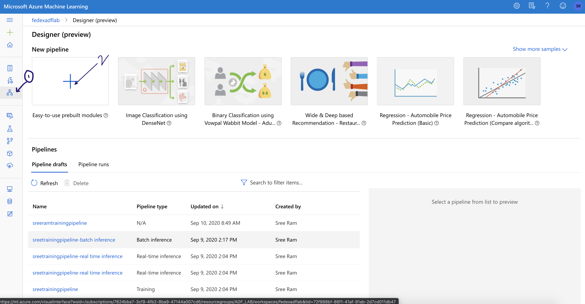

  ---

- A blank canvas as below will be open. you can replace the default pipeline name with your own name and as shown select the predefined compute target and the default data store for running this pipeline.

  ---
  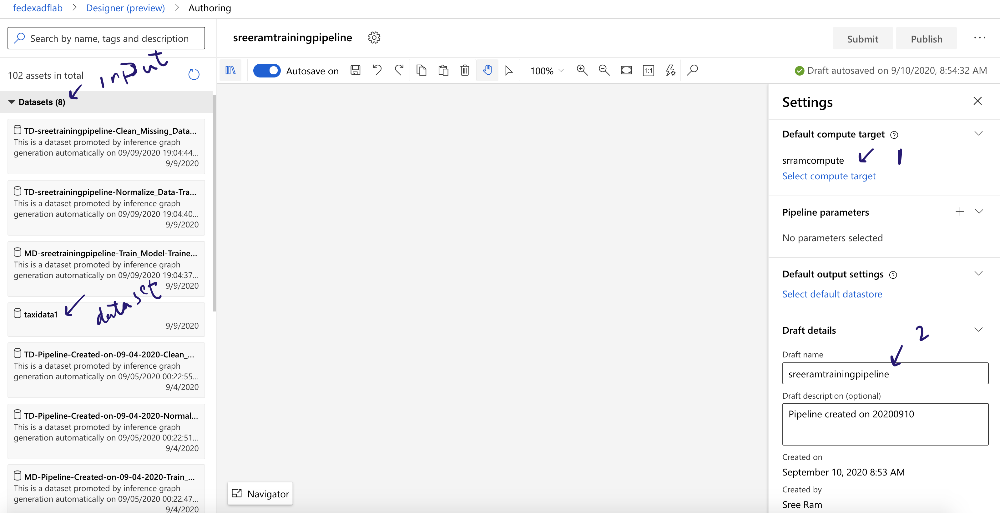

  ---

- Check for the data sets expand the datasets choose the taxi data set we created for you. It is the same data set that we have created using the data factory and committed to the curated layer after applying the transformations. Drag and drop the data set onto the canvas. *A Very Useful Tip - **You can search any module in the search box which is the easiest way to find any module***

  ---
  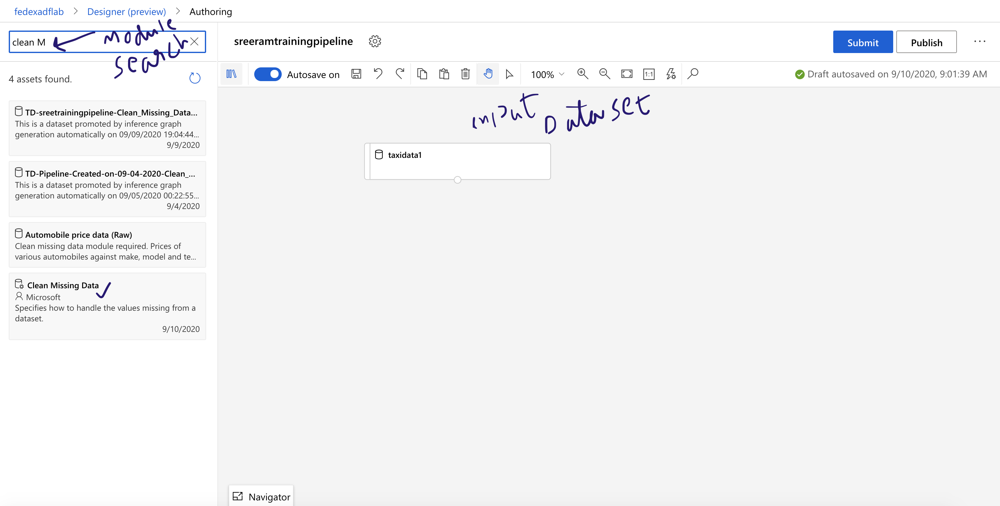

  ---

- Let's clean the missing data. Drag the “clean missing data” module from the data transformations tab. *Search as shown Above and drag onto canvas* Click on the module to configure the parameters. Let’s choose the missing value ratio to a minimum of zero and the maximum of 100%. Let's replace any missing values with their means. *Don't forget to connect the modules*

  ---
  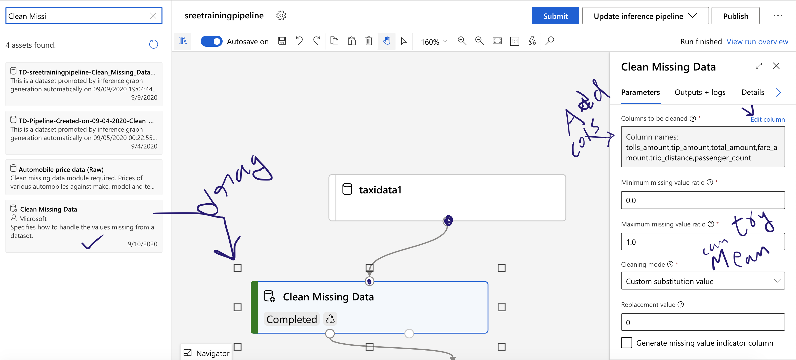

  ---

- Press the submit button. As we we work with the pipeline, we start growing it keep running at every step if you choose to do so. As shown in the following screenshot, provide the experiment your name-experiment for the first time and press submit. Subsequently, we use the same experiment name. This helps the service log all the related information in the same place.

  ---
  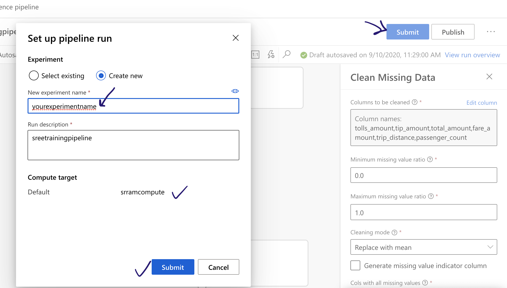

  ---

- Let's edit metadata using “edit metadata” module in order to convert the columns shown into the categorical columns. Converting the list of values into the categorical columns is a requirement for performing any machine learning exercise.

  ---
  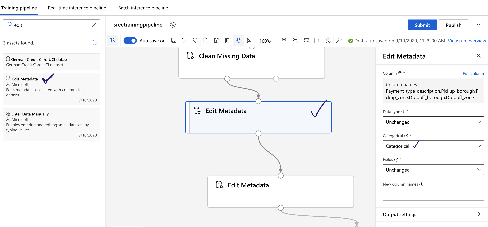

  ---

- Also, we need to edit the metadata for the label column called the tip amount that needs to be converted into a label. Drag the edit metadata module; Within parameters go to column edit column choose the column named tip amount change the field to the label.
  
  ---
  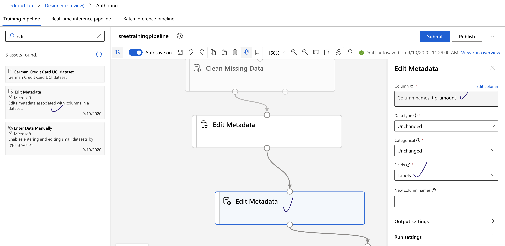

  ---

- Let's eliminate the outliers for which we choose “Clip Values” module and choose clip peaks with upper threshold as percentile and let's choose 99th percentile as an outlier. Let's substitute the peak values with median for all the numerical columns shown below.

  ---
  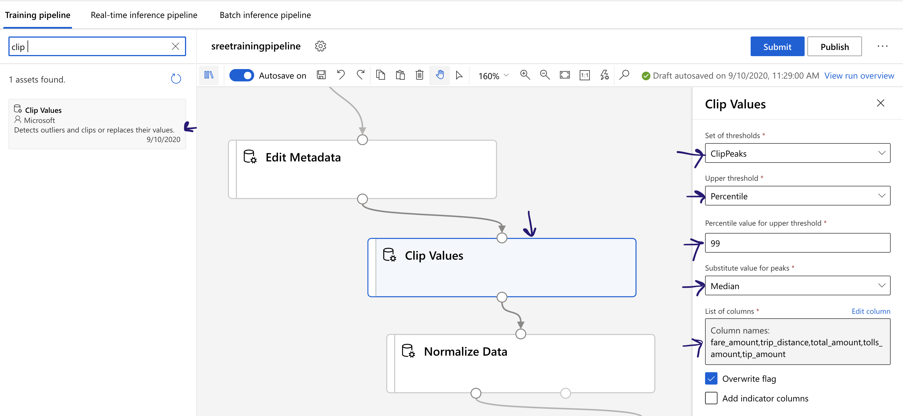

  ---

- Let's normalize the numerical columns. Normalizing the numerical columns ensures the algorithm to be performant and find solution lot faster we usually use the z-score to normalize. Choose “Normalize Data” module choose z-score as the transformation method. choose the numerical columns shown for the normalization.

  ---
  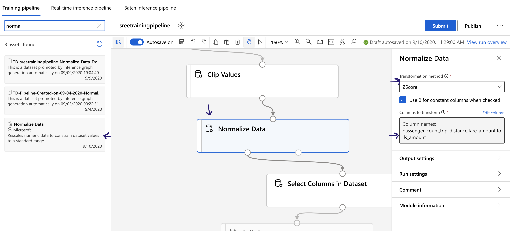

  ---

- Select only the columns that are needed for the modeling. Usually, we eliminate the identifiers and the duplicate columns that represent the dates and any columns that have all the values as null. Following screenshot shows the column names that we are interested in for this machine learning exercise. We use the “Select columns in Data set” module to select the needed columns.

  ---
  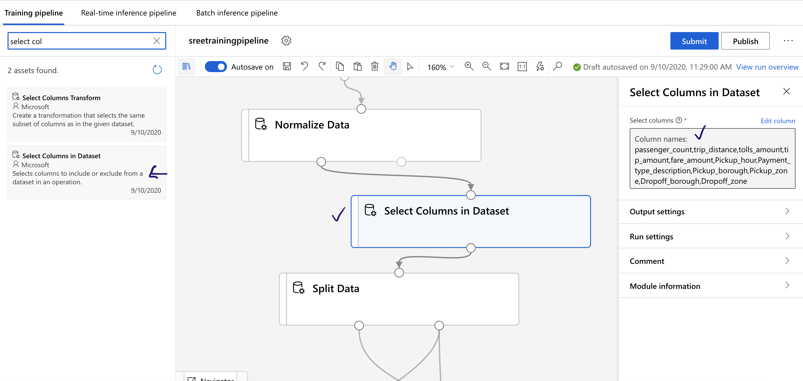

  ---

- Let’s perform one last transformation for the data split to make sure we split the data between training and testing our model. As we have plenty of data, we split the data into 60%-40% for training and testing respectively. We perform a randomized split and will choose stratified split to be false. We use “Split Data” module.

  ---
  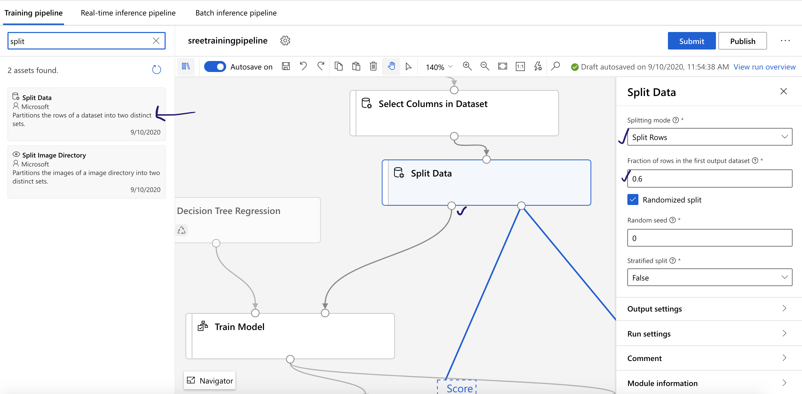

  ---

- We have now completed all the data transformations and future engineering that is needed for us to build a machine learning model. Machine learning model starts with training the model. In order to train the model, we need a training algorithm and a training data set. Let's start training the model with the module called “train model”. Train model needs two inputs an algorithm to train and the training data set from split data module. Connect the training data set with 60% split from previous module and connect an algorithm called boosted decision tree regression. From model training choose “Train Model” module and from Machine Learning Algorithms choose “Boosted Decision Tree Regression” You can customize model to choose parameter range as shown.

  ---
  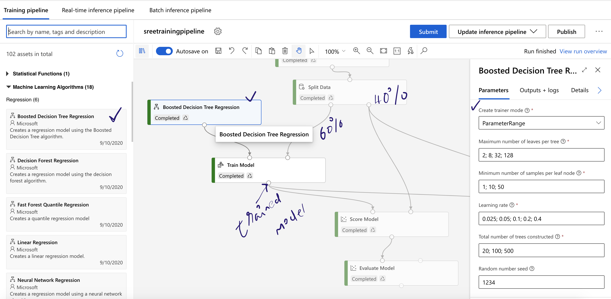

  ---

- Choose the label column as tip amount in "Train Model"

  ---
  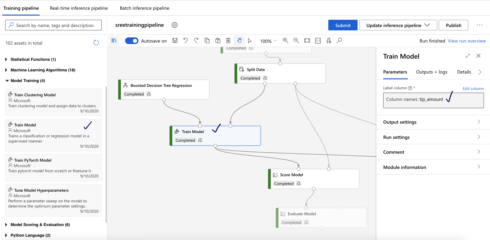

  ---

- Underneath the section called "Feature Selection" choose a module called the“Permutation Feature Importance” that takes the trained model and the test data from the previous steps to find those attributes that contribute maximum to the model.

  ---
  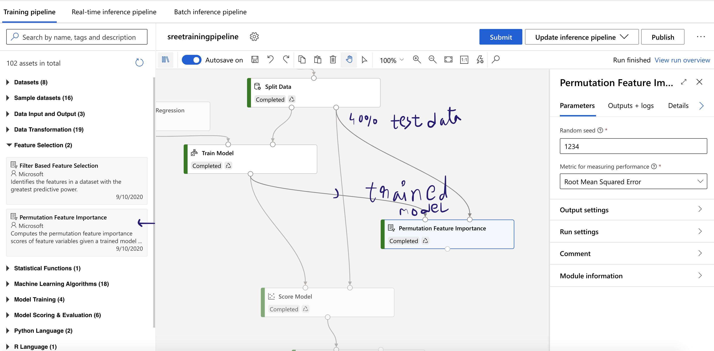

  ---

- We use the score model to score the test data. We use the trained model from the previous step and the test data from the "split data" module. We can connect “Evaluate Model” to the score model. Submit and finish the run. On "Evaluate Model" we can see how well the test data performed with the train model. We can also see the metrics such as root mean square and R2 score for this regression scenario. Choose Outputs + logs once the run is complete and look for the metrics. 73% model explanation of data is pretty good for a 20-minute exercise. We can further fine-tune, test and compare various models. We also have AutoML which is the driverless machine learning tool where you can use the same training data set to run against various models and choose the best model.

  ---
  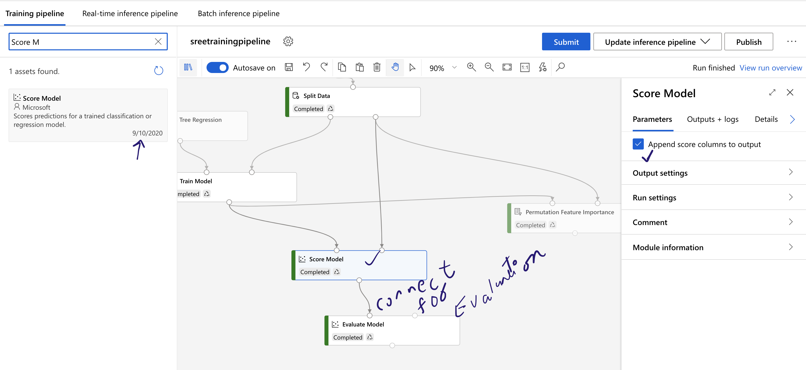

  ---

## Create an inference pipeline and publish

- Once we are satisfied with our training exercise the next step is to create a Batch inference pipeline. Please wait for the inference pipeline to be created and donot press submit button. Let's check the new pipeline.

  ---
  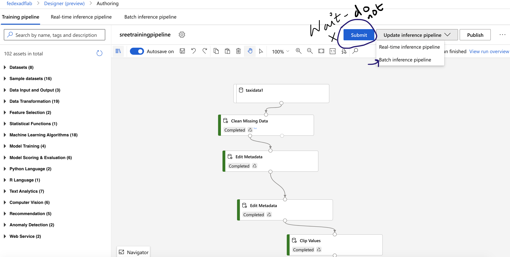

  ---
  
- We must remove some unnecessary modules from the pipeline. Let's go ahead and remove the evaluate model, permutation future importance modules. In addition, we use our own input and output wherein we use the input as a scoring file from the storage blob. We score the file and the resultant output is stored in a storage blob. We use "Import Data" and "Export Data" from the “Data Input and Output” section. Import data module goes in the place of taxi data input. Configure as shown below.

  ---
  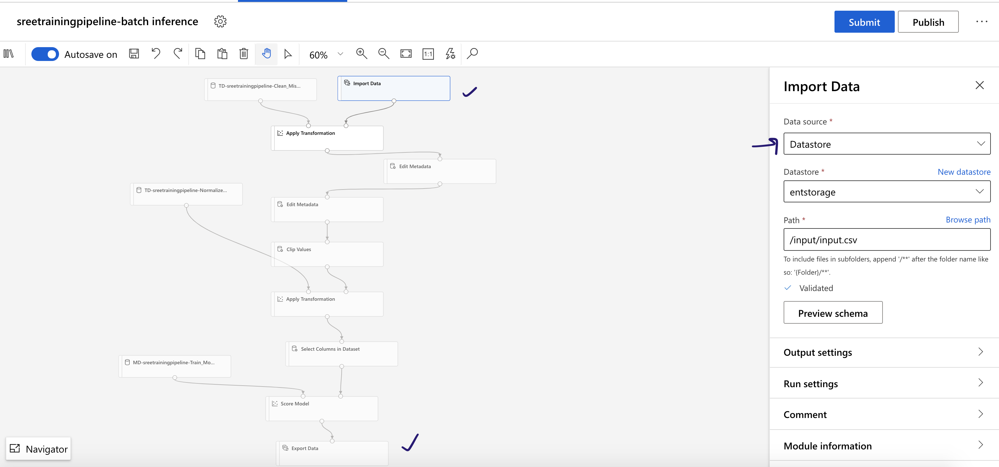

  ---

- Now Attach the export data as the last module after score module. Let’s configure the export module as follows. __You need to add output path as a pipeline parameter__. Follow the sequence shown below. Submit the inference pipeline for the run.

  ---
  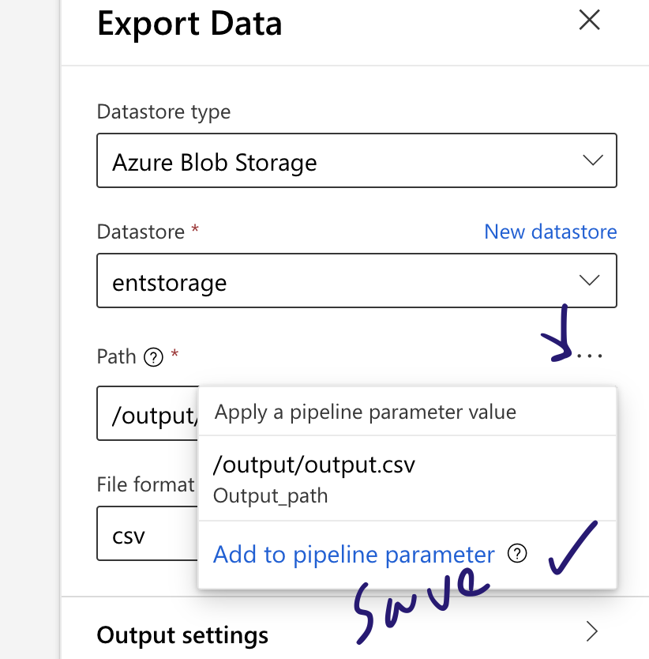

  ---

  ---
  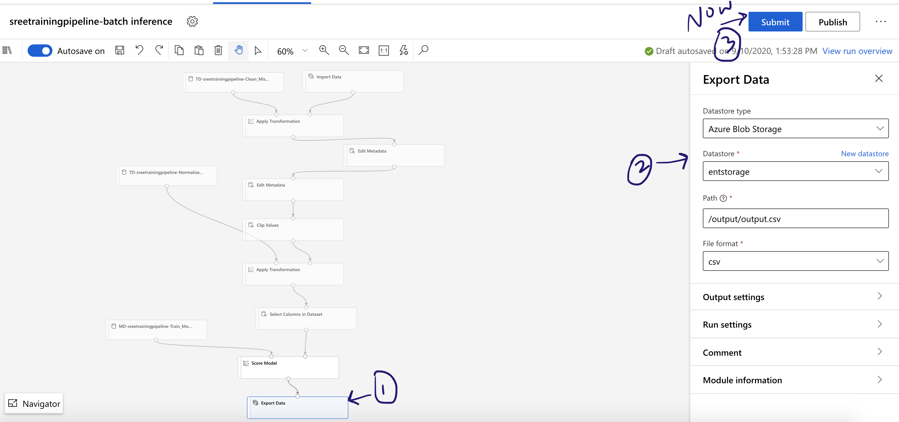

  ---

- Once the pipeline run is complete, we will publish the pipeline hitting “Publish” button. The inference pipeline will be published as a rest end point. The resulting rest endpoint is called from the Azure data factory pipeline.

  ---
  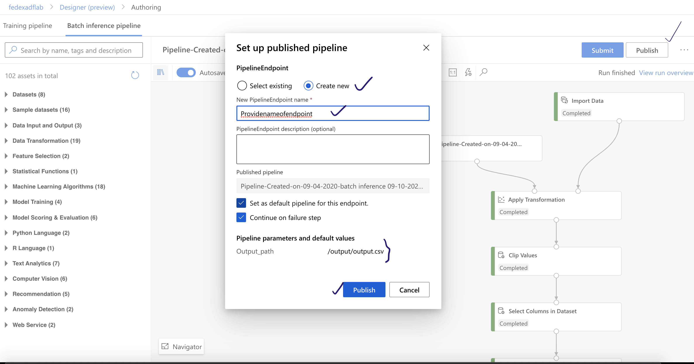

  ---
