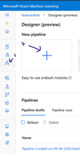
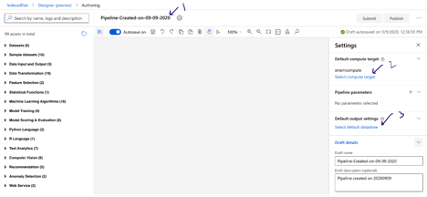

# Azure ML Designer Lab

## Background

Your taxi Commission for a major city has asked you to create a machine learning model that takes various trip attributes and predict the tip amount driver might expect. This helps the Commission some answers for their drivers to maximize their profit.

## Learning Objectives

In this lab, you will learn how to Azure Machine Learning designer to feature engineer the data and train a regression model from the dataset you created using the Azure data factory.

## The Data

We use the data from the previous exercise. we created a ready made dataset in the Azure ML Workspace named *taxidata* to save some time for you. Let's use this to start Modeling.

## Create a Training Pipeline

- Login to the ML Workspace on the left pane click designer as shown below by clicking "Designer Icon" followed by "New pipeline"
  

- A blank canvas as below will be open. you can replace the default pipeline name with your own name and as shown select the predefined compute target and the default data store for running this pipeline.
  
